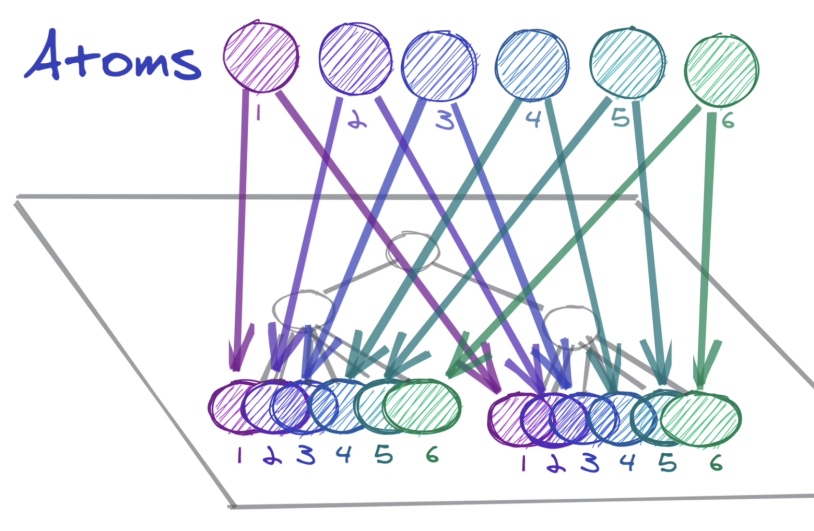

리코일 0.6.0 버전으로 작성된 글입니다.

## Context API를 사용할 때 발생하는 문제점

보통 `Context API`를 사용해서 스토어를 관리하고 `Provider`를 사용해서 자식으로 상태를 내려주는 방법을 사용하게 되면, 이 `context`가 통과하는 모든 컴포넌트들이 리렌더링되는 문제점이 있습니다.

```tsx
// Context API를 사용하는 경우

const Context = createContext(0);
const useGetContextState = () => useContext(Context);

const App = () => {
  const [state, setState] = useState(0);

  return (
    <Context.Provider value={state}>
      <button onClick={() => setState((prev) => prev + 1)}>+</button>
      <PassingComp />
    </Context.Provider>
  );
}

const PassingComp = () => {
  console.log('Component A is rendered')
  // state를 사용하지 않지만 state의 상태가 바뀔때마다 리렌더링 됩니다.

  return <DestinationComp />
}

const DestinationComp = () => {
  const state = useGetContextState()

  return <div>{state}</div>
}
```

그런데 `Recoil`을 사용하면 위와같은 문제가 발생하지 않습니다. `Recoil`도 사용하려면 일단 `RecoilRoot`로 감싸줘야해서 저는 `RecoilRoot`에서 `Context API`를 사용해서 상태를 내려주지만 무언가 처리를 해주기 때문에 리렌더링이 발생하지 않도록 하는건 아닐까? 생각이 들었습니다.

## Recoil은 어떻게 해결했을까?

`Recoil(0.6.0)` 내부 구현을 살펴본 결과, 일단 `Recoil`에서는 스토어를 `React`의 상태로 갖고 있는게 아니라 `React ref` 형태로 관리를 하고, `useStoreRef` 훅을 사용해 내려주고 있었습니다.

```tsx
// Recoil_RecoilRoot.js
// 이해의 편의를 위해 실제 소스코드에서 설명에 필요한 부분만 발췌해왔습니다.

const defaultStore = Object.freeze({
  storeID: getNextStoreID(),
  getState: notInAContext,
  replaceState: notInAContext,
  getGraph: notInAContext,
  subscribeToTransactions: notInAContext,
  addTransactionMetadata: notInAContext,
});

const AppContext = React.createContext({ current: defaultStore });
const useStoreRef = () => useContext(AppContext);

const RecoilRoot = () => {
  storeRef = ... // 스토어 생성

  return (
    <AppContext.Provider value={storeRef}>
      {children}
    </AppContext.Provider>
  );
}
```

이렇게 내려주고 있는 스토어가 `React`의 `state`가 아니기때문에 상태변경에도 이 `context`가 통과하는 컴포넌트들을 리렌더링 하지 않는 것이었습니다.

그렇다면 이제 `Recoil`이 `React` 상태를 `Context API`로 내려주고 있는 게 아니라 스토어를 그냥 `ref` 형태로 내려주고 있어서 리렌더링이 안되고 있다는 건 알았습니다.

그럼 어떻게 `Recoil`의 `atom`을 `setState` 해주었을 때 이 `atom`의 `value`를 사용하고 있는 컴포넌트들이 리렌더링 될 수 있는걸까요?

## useRecoilValue 훅의 subscribe

이를 알기 위해서는 `Recoil`의 스토어에서 상태를 가져올 때 사용하는 `useRecoilValue` 훅을 먼저 살펴봐야 합니다. 

`useRecoilValue` 훅은 다음과 같이 구현되어 있습니다.

```tsx
// Recoil_Hooks.js

function useRecoilValue(recoilValue) {
  // 이해의 편의를 위해 실제 소스코드에서 설명에 필요한 부분만 발췌해왔습니다.

  const storeRef = useStoreRef();
  const loadable = useRecoilValueLoadable(recoilValue);
  return handleLoadable(loadable, recoilValue, storeRef);
}
```

여기 보면 `useStoreRef`를 사용해서 `Recoil` 스토어의 `ref`를 받아오고 있고, `useRecoilValueLoadable` 훅을 사용해서 `Loadable`을 얻어내고 있습니다.
(`handleLoadable`은 `React Suspense`를 활용해서 비동기처리를 할 수 있게 해주는 함수입니다)

여기서 중요한 부분은 `useRecoilValueLoadable` 훅인데, 이 훅은 다음과 같이 구현되어있습니다.

```tsx
// Recoil_Hooks.js

function useRecoilValueLoadable(recoilValue) {
  // 이해의 편의를 위해 실제 소스코드에서 설명에 필요한 부분만 발췌해왔습니다.

  return {
    CONCURRENT_LEGACY: useRecoilValueLoadable_CONCURRENT_LEGACY,
    SYNC_EXTERNAL_STORE: useRecoilValueLoadable_SYNC_EXTERNAL_STORE,
    MUTABLE_SOURCE: useRecoilValueLoadable_MUTABLE_SOURCE,
    LEGACY: useRecoilValueLoadable_LEGACY,
  }[reactMode().mode](recoilValue);
}
```

이렇게 여러가지 `reactMode`에 대한 `useRecoilValueLoadable` 훅 구현체가 있습니다.

(제가 개발하는 프로젝트의 경우는 `React 17`버전을 사용하고 있고, `Recoil 0.5.2`버전을 사용하고 있었는데, 이 경우에는 `useRecoilValueLoadable_LEGACY` 훅을 사용하게 됩니다)

`useRecoilValueLoadable_LEGACY` 훅을 기준으로 조금 더 살펴보면, 

```tsx
// Recoil_Hooks.js

function useRecoilValueLoadable_LEGACY(recoilValue) {
  // 이해의 편의를 위해 실제 소스코드에서 설명에 필요한 부분만 발췌해왔습니다.
  
  const [, forceUpdate] = useState([]);

  useEffect(() => {
    const subscription = subscribeToRecoilValue(
      _state => {
        const newLoadable = getLoadable();
        forceUpdate(newLoadable);
      },
      ...,
    );  
  }, [...])

  return loadable
}
```

`useState`를 사용해서 `setState`를 `forceUpdate`로 명명해두고, 해당 함수가 원하는 시점에 실행될 수 있게 `subscribeToRecoilValue`이라는 함수의 콜백함수로 지정해두게됩니다.

즉, 이렇게 `useRecoilValue` 컴포넌트를 사용하는 컴포넌트는 자연스럽게 `subscribeToRecoilValue` 함수를 통해 인자로 들어오는 `recoilValue(= 우리가 넣어주는 atom/selector)`에 대해 subscribe를 하게되고, `subscribeToRecoilValue`에 등록된 콜백이 `Recoil` 런타임에서 정해진 시점에 호출될 때 `useState`의 상태가 바뀜에 따라 해당 컴포넌트만 리렌더링이 되게 됩니다.

**그렇다면 subscribeToRecoilValue 함수는 어느 시점에 호출되는 걸까요?**

이를 위해서는 `Recoil`에서 `setState`가 발생할때 어떤 과정이 이루어지는지를 살펴봐야합니다.

## useSetRecoilState 훅

```tsx
// Recoil_Hooks.js

function useSetRecoilState(recoilState) {
  // 이해의 편의를 위해 실제 소스코드에서 설명에 필요한 부분만 발췌해왔습니다.
 
  const storeRef = useStoreRef();

  return useCallback(
    (newValueOrUpdater) => {
      setRecoilValue(storeRef.current, recoilState, newValueOrUpdater);
    },
    [storeRef, recoilState],
  );
}
```

저희가 `Recoil`의 상태를 set하기 위해서 사용하는 `useSetRecoilState` 훅을 살펴보면 내부적으로 `setRecoilValue` 함수를 실행하고 있습니다.

그리고 `setRecoilValue` 함수는 다음과 같이 구현되어있습니다.

```tsx
// Recoil_RecoilValueInterface.js

function setRecoilValue(store, recoilValue, valueOrUpdater) {
  // 이해의 편의를 위해 실제 소스코드에서 설명에 필요한 부분만 발췌해왔습니다.
 
  queueOrPerformStateUpdate(store, {
    type: 'set',
    recoilValue,
    valueOrUpdater,
  });
}
```

다시 또 `queueOrPerformStateUpdate` 함수의 구현체를 보면

```tsx
// Recoil_RecoilValueInterface.js

function queueOrPerformStateUpdate(store, action) {
  // 이해의 편의를 위해 실제 소스코드에서 설명에 필요한 부분만 발췌해왔습니다.
 
  if (batchStack.length) {
    const actionsByStore = batchStack[batchStack.length - 1];
    let actions = actionsByStore.get(store);
    if (!actions) {
      actionsByStore.set(store, (actions = []));
    }
    actions.push(action);
  } else {
    applyActionsToStore(store, [action]);
  }
}
```

다음과 같이 구현되어있는데, if 문에 있는 `batchStack.length` 는 현재 `Recoil`이 배치 처리중인지를 의미합니다. 배치 처리중이라면 `actions`에다가 이번에 `queueOrPerformStateUpdate` 함수의 인자로 들어온 `action`을 넣어주고, 배치 처리중이 아니라면 바로 `applyActionsToStore` 함수를 실행해줍니다.  
(배치처리는 `batchStart` → `batchUpdate callback 실행` → `batchEnd` 의 순서를 갖는데, 이 `batchEnd` 시점에도 `applyActionsToStore` 함수가 똑같이 실행됩니다)

`applyActionsToStore` 함수는 다음과 같이 구현되어있는데, 

```tsx
// Recoil_RecoilValueInterface.js

function applyActionsToStore(store, actions) {
  // 이해의 편의를 위해 실제 소스코드에서 설명에 필요한 부분만 발췌해왔습니다.
  
  store.replaceState(state => {
    const newState = copyTreeState(state);

    for (const action of actions) {
      applyAction(store, newState, action);
    }

    return newState;
  });
}
```

살펴보면 `Recoil store`에 있는 `replaceState` 함수를 통해 상태를 `newState`로 바꾸게 되는데, 이 과정에서 `applyAction` 함수를 통해 `action`을 상태에 반영하게됩니다.

그리고 `replaceState` 함수는 다음과 같이 구현되어있습니다.

```tsx
// Recoil_RecoilRoot.js

const replaceState = replacer => {
  // 이해의 편의를 위해 실제 소스코드에서 설명에 필요한 부분만 발췌해왔습니다.

  const nextTree = storeStateRef.current.nextTree
  let replaced;
  
  replaced = replacer(nextTree);

  storeStateRef.current.nextTree = replaced;
  
  if (reactMode().early) { // true
    notifyComponents(storeRef.current, storeStateRef.current, replaced);
  }
  
  notifyBatcherOfChange.current();
};
```

`replaceState`의 인자로 들어오는 콜백함수(`replacer`)를 호출해서 그 결과를 `storeStateRef.current.nextTree` 에 반영하고 `notifyComponents` 함수를 호출하게 됩니다.

그리고 이 `notifyComponents` 함수가 위의 저희의 의문이었던 “**그렇다면 subscribeToRecoilValue 함수는 어느 시점에 호출되는 걸까요?**” 의 답이 되게 됩니다.

즉, `notifyComponents` 함수가 호출되면 `subscribeToRecoilValue` 함수가 호출되고, 결과적으로 `useRecoilValue` 훅에 있던 `forceUpdate`가 호출됨에 따라 상태와 연관된 컴포넌트만 리렌더링 되게 됩니다.

## 결론

결과적으로, `useRecoilValue` 훅을 사용하는 컴포넌트는 자동적으로 `Recoil recoilState`를 subscribe 하게 되고, 이 subscribe 과정에서 `useRecoilValue` 훅에 있는 `useState`의 `setState(= forceUpdate)`를 넘겨주게 됩니다.

그리고 subscribe 하고 있는 `recoilState`가 set 되는 시점에 적절하게 `forceUpdate` 함수가 실행되게되면서 subscribe하고 있는 컴포넌트만 리렌더링이 발생하게 됩니다.



위의 이미지는 [Recoil 공식문서에 있는 Recoil 소개 Youtube](https://www.youtube.com/watch?v=fb3cOMFkEzs)에서 자료로 나왔던 그림입니다.

Recoil 스토어에서 현재 subscribe 하고 있는 컴포넌트에다가만 상태를 쏴주는 모습을 정말 잘 담아내고 있는 그림이라고 생각해서 첨부합니다.

<br><br>

부족함이 많은 글 읽어주셔서 감사합니다.