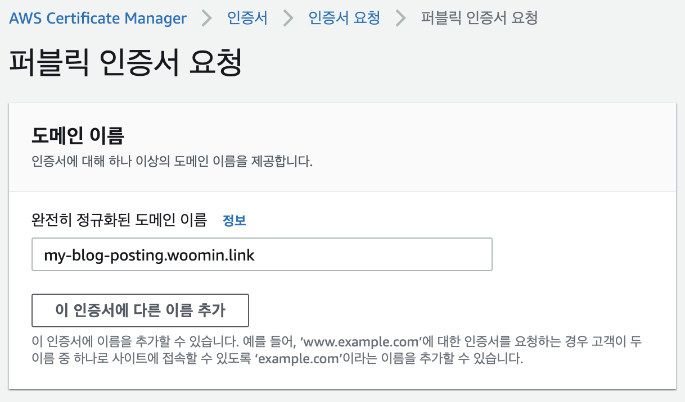

정적 웹사이트 호스팅은 간단하게는 다음과 같은 과정을 거칩니다.

1. [정적 파일을 웹서버에 업로드](#1-정적-파일을-웹서버에-업로드)
   - 정적파일에 접근 할 수 있는 범위 설정
2. [CDN을 통해 어느 물리적 위치에서도 빠르게 접근할 수 있도록 설정](#2-cdn을-통해-어느-물리적-위치에서도-빠르게-접근할-수-있도록-설정)
   - 웹서버의 정적 파일을 직접 접근할 수 없고 CDN을 통해서만 접근할 수 있도록 설정
   - CDN cache invalidate
3. [도메인을 구매하고 CDN 배포와 연결하기](#3-도메인을-구매하고-cdn-배포와-연결하기)
   - TLD와 레코드(A, CNAME)
4. [정적 파일들에 대해 브라우저 캐시와 CDN 캐시를 잘 이용할 수 있도록 설정](#4-정적-파일들에-대해-브라우저-캐시와-cdn-캐시를-잘-이용할-수-있도록-설정)
   - Cache-Control 헤더의 max-age, s-max-age

보통 이런 과정들은 Vercel이나 Netlify, Cloudflare Pages과 같은 정적 웹사이트 호스팅 서비스를 사용하면 자동으로 진행해주고 편하게 배포를 마무리할 수 있습니다. (아마 훨씬 더 많은 처리와 최적화를 해줄 것 같습니다)

하지만 이런 과정들에 대해 얕게나마 구성하며 이해해보고자 AWS S3와 CloudFront 서비스를 통해 배포해보려합니다.

## 1. 정적 파일을 웹서버에 업로드

AWS S3가 하는 역할은 정적 파일들을 보관하는 스토리지입니다. HTML, JS, CSS, 그리고 이미지나 동영상 등 여러 에셋들을 포함합니다.

아울러 AWS S3에 파일을 업로드하면 해당 객체에 대해 URL을 통해 접근할 수 있으므로 웹서버의 역할을 한다고 볼 수도 있을 것 같습니다.

먼저 S3 버킷을 하나 만듭니다. 저는 `my-blog-posting-bucket`이라는 이름으로 만들었습니다. 모든 설정을 기본으로 된걸 그대로 사용하고, “버킷의 퍼블릭 엑세스 차단 설정”이 디폴트로는 “모든 퍼블릭 엑세스 차단”으로 설정돼있는데, 우리는 퍼블릭하게 정적 배포된 파일을 노출해줘야하므로 모든 체크 박스를 해제해주도록 합니다.


이렇게 버킷을 하나 생성하고, 여기에 우리의 HTML 파일을 하나 업로드합니다.

```html
<-- index.html -->
<!DOCTYPE html>
<html lang="ko">
  <head>
    <meta charset="UTF-8" />
    <title>Woomin Blog</title>
  </head>
  <body>
    <h1>S3 + CloudFront로 정적 배포 과정 이해하기</h1>
  </body>
</html>
```

그리고 S3 버킷의 해당 `index.html` 파일로 들어가 객체 URL로 접근 하면, 아래와 같은 `AccessDenied` 에러가 발생합니다.


이건 S3에 대한 버킷정책을 설정해주지 않아서 엑세스를 할 수 없다는 의미이므로 버킷 정책을 설정하러 갑니다. “권한” 탭의 버킷 정책 섹션에서 버킷 정책을 작성하면 되는데, AWS에서 [정책생성기](https://awspolicygen.s3.amazonaws.com/policygen.html)라는 편한 툴을 제공해주고 있어서 이를 사용하면 됩니다.

```json
{
  "Id": "Policy1671867610853",
  "Version": "2012-10-17",
  "Statement": [
    {
      "Sid": "Stmt1671867606782",
      "Resource": [
        // 다음과 같은 리소스에 대한
        "arn:aws:s3:::my-blog-posting-bucket",
        "arn:aws:s3:::my-blog-posting-bucket/*"
      ],
      "Action": ["s3:GetObject"], // S3 객체에 대한 접근을
      "Principal": "*", // 모두
      "Effect": "Allow" // 허용합니다.
    }
  ]
}
```

이제 다시 `index.html` 객체의 URL로 접근을 하면, 정상적으로 나오는 것을 확인할 수 있습니다.


## 2. CDN을 통해 어느 물리적 위치에서도 빠르게 접근할 수 있도록 설정

CDN이란 네트워크 통신의 물리적 거리 제약을 개선하기 위해 세계 여러곳에 배치된 중간 서버를 사용하여 불필요한 네트워크 통신 거리를 줄여 빠르게 에셋을 전달하는 방법입니다. 자세한 내용은 [AWS CDN 설명](https://aws.amazon.com/ko/what-is/cdn/)을 참고하시면 됩니다.

저는 AWS에서 제공해주는 CloudFront라는 CDN 서비스를 사용했습니다.

앞서 생성한 S3 버킷에 올린 파일에 대해서 외부에서 정상적으로 접근할 수 있도록 처리했으니, 이제 CloudFront를 붙이도록 합니다.

먼저 CloudFront 서비스로 이동해서 배포를 생성합니다. 다른 설정들은 모두 기본으로 설정된 걸 따르고 다음과 같은 부분들만 수정해줍니다.


- 원본 도메인
  - 어떤 에셋에 대한 배포를 할건지를 결정하는 부분입니다.
  - 우리가 생성한 S3 버킷을 향하도록 합니다.
- 원본 경로
  - CloudFront를 통해 접근할 때 S3 버킷의 어떤 디렉터리를 바라보도록 할건지를 결정하는 부분입니다.
  - 우리는 딱히 버킷에 디렉터리를 설정하지 않았으므로 아무것도 입력하지 않아도 됩니다.
    (만약 S3 버킷의 static이라는 디렉터리를 생성하고 `index.html` 파일을 static 디렉터리 내부에 위치시킨다면, 원본 경로로 `/static`을 입력해줘야합니다)
- S3 버킷 엑세스
  - S3 버킷의 접근 권한 정책을 새로 설정하는 부분입니다. 위에서 버킷 정책으로 `Principal": "*"`처럼 처리하게 되면 모든 곳에서 우리의 S3 객체에 접근할 수 있게 되어 보안상, 그리고 비용상 좋지 않습니다. 그러므로 CloudFront를 통해서만 접근할 수 있도록 설정이 필요한데 이 설정을 “S3 버킷 엑세스” 섹션에서 할 수 있습니다.
  - 여기서 “원본 엑세스 제어 설정(권장)”을 체크하고, 제어 설정을 생성합니다. 그럼 자동으로 CloudFront를 통해서만 S3 버킷에 접근할 수 있는 버킷정책을 제공해주는데, 이걸 복사해서 우리가 위해서 설정한 S3 버킷설정 대신에 붙여넣어주면 됩니다.
    (만약 정책 복사 버튼이 보이지 않는다면 저장 후 편집을 통해 접근하면 볼 수 있습니다)

이제 앞서 CloudFront에서 자동으로 생성해줬던 S3 버킷 정책으로 우리의 S3 버킷 정책을 업데이트 해줍니다.

```json
{
  "Version": "2008-10-17",
  "Id": "PolicyForCloudFrontPrivateContent",
  "Statement": [
    {
      "Sid": "AllowCloudFrontServicePrincipal",
      "Resource": [
        // 다음과 같은 리소스에 대한
        "arn:aws:s3:::my-blog-posting-bucket",
        "arn:aws:s3:::my-blog-posting-bucket/*"
      ],
      "Action": ["s3:GetObject"], // S3 객체에 대한 접근을
      "Principal": {
        // CloudFront 서비스의
        "Service": "cloudfront.amazonaws.com"
      },
      "Condition": {
        // 다음 식별자에 대해서만
        "StringEquals": {
          "AWS:SourceArn": "arn:aws:cloudfront::099095330630:distribution/E2JTLB8D12Y8T2"
        }
      },
      "Effect": "Allow" // 허용합니다.
    }
  ]
}
```

이제 CloudFront로 돌아가서 배포 도메인을 열어보면 `AccessDenied` 에러가 발생합니다.


하지만 URL 뒤에 경로를 명시해주면 잘 동작하는 걸 확인할 수 있습니다.


이는 CloudFront에서 우리가 기본 루트 객체를 설정하지 않아서, 원본 디렉터리로 바로 접근해서 발생하는 이슈입니다.

CloudFront “일반” 탭에서 설정 섹션의 편집 페이지로 들어가서 “기본값 루트 객체”를 `index.html`로 설정합니다. 이제 해당 도메인의 루트로 접근했을 때 자동으로 `index.html`을 내려줄 것입니다.


그다음 다시 CloudFront 배포 도메인을 열어보면,


또 다시 AccessDenied 화면이 보입니다. 이건 기존에 CloudFront 배포를 통해 생성된 캐시가 아직 존재해서 발생하는 이슈입니다.

다음과 같이 CloudFront 무효화를 생성합니다.


이후 무효화(Cache invalidate) 과정이 종료되고나서 다시 접근하면 정상적으로 화면이 보이는 걸 확인할 수 있습니다.


그런데 여기에 문제가 한가지 더 있는데, 만약 다른 경로로 접근했을 경우 화면이 정상적으로 보여지지 않는다는 것입니다. 예를들어 SPA로 배포를 했고, 클라이언트 사이드 라우팅을 사용하고 있다면, 유저가 `/example` 이라는 경로에 접근 한 뒤 새로고침을 하게되면 다음과 같이 또 AccessDenied 페이지를 만나게 됩니다.


이는 잘못된 경로로 접근했을 때의 fallback을 설정해주지 않아서 발생하는 문제입니다.
다시 CloudFront 설정 페이지로 가서 “사용자 정의 오류 응답”을 생성합니다.

`AccessDenied`와 같은 403 에러에 대해서 `index.html`을 200으로 내려주면 됩니다.


이렇게 잘못된 경로로 들어왔을 때 fallback으로 `index.html`을 내려주는게 앞서 이야기한 “클라이언트 사이드 라우팅 시 새로고침 이슈”를 해결할 수 있는 이유는,

- 새로고침을 하게되면 클라이언트 사이드 라우팅에 설정된 `/example`이라는 경로로 요청이 갈 것이고, 일치하는 게 없을 것이기 때문에 자동으로 fallback으로 설정된 `index.html`을 내려줍니다.
- 그러면 HTML파일을 받은 브라우저는 `index.html`을 파싱하고, 그 과정에서 JS 파일을 불러옵니다.
- 그리고 이 JS 파일 안에 포함된 클라이언트 사이드 라우팅 코드(예를들면 react-router)가 URL을 확인하여 `/example`에 맞는 컴포넌트를 렌더링해주어 결과적으로는 새로고침에도 문제없는 클라이언트 사이드 라우팅을 수행할 수 있게됩니다.

그리고 역시 앞에서와 같이 CloudFront을 타도록 설정했기에 자동으로 캐시가 되므로 무효화를 한번 더 해줍니다.

이제 정상적으로 화면이 나타나며, 클라이언트 라우팅 중 새로고침을 해도 정상적으로 해당 경로에 맞는 화면이 보일 수 있습니다.


모든 준비는 끝났습니다! 이제 유저는 정상적으로 CDN을 타고 어떤 물리적 위치에서든 빠르게 페이지에 접근하는 게 가능합니다.

## 3. 도메인을 구매하고 CDN 배포와 연결하기

이제 `d1w725savs7jx.cloudfront.net` 과 같은 어색한 도메인이 아니라 직접 도메인을 할당해서 붙여보도록 하겠습니다.

저는 AWS Route53을 통해서 `woomin.link`라는 도메인을 구매했습니다. 이제 저는 link라는 TLD에서 woomin이라는 네임스페이스를 관리할 수 있게 된 것입니다. 이말은 즉, `woomin.link` 라는 네임스페이스 내에서는 서브도메인으로 무엇이든 붙여서 제 마음대로 라우팅을 시킬 수 있음을 의미합니다. `naver.woomin.link`를 만들고 해당 도메인으로 접근 시 네이버로 이동시키는 것도 가능합니다.

- TLD란 Top Level Domain, 즉 최상위 도메인을 뜻하며, 도메인의 가장 끝에서 관리되는 `.com`과 같은 친구들을 의미합니다. 일단 도메인이라는 것 자체는 ICANN이라는 “국제 인터넷주소 관리 기구”라는 곳에서 관리를 하고 있는데, 이곳에서 TLD들을 종류에 따라 관리합니다.
  - 국가에서 관리하는 ccTLD(Contry Code TLD). 대표적으로 `.kr`
  - 일반적인 영리 기구에서 관리하는 gTLD(Generic TLD), 근-본이라고 할 수 있습니다. 대표적으로 `.com`
  - 기존의 TLD들로는 부족해져서 새롭게 생겨나고있는 new gTLD가 있습니다. 예를들면, `.xyz`

이제 Route53에서 레코드 생성을 하겠습니다. 서브도메인으로는 `my-blog-posting`으로, 레코드 유형은 CNAME으로 한 뒤, CloudFront에서 제공해주었던 `d1w725savs7jx.cloudfront.net` 도메인을 값으로 입력해줍니다. (A 레코드로도 가능합니다)

- A 레코드? CNAME 레코드?
  - 일단 도메인이라는 것 자체가 숫자의 나열뿐인 IP주소만으로는 사람이 기억하기 어려우니까 시멘틱하게 이름을 붙여주고, 이걸 IP주소와 매핑시켜주어 이름만으로 해당 IP주소에 접근가능하게 하는 역할입니다.
  - 그래서 기본적으로 DNS 서버에는 Domain Name과 IP주소 간에 1:1로 매핑이 되어있습니다.
    ```json
    |     Domain Name     |     IP Address     |
    |---------------------|--------------------|
    | naver.com           | 192.123.123.123    |
    ```
    이렇게 Domain Name과 IP Address가 1:1로 매핑된 것을 **A Record**라고 합니다.
  - 그리고 **CNAME(Canonical Name) Record**는 Domain Name이 IP Address와 매핑된게 아니라, 다른 Domain Name과 매핑된걸 말합니다.
    ```json
    |     Domain Name     |     IP Address     |
    |---------------------|--------------------|
    | naver.com           | 192.123.123.123    | <<< A Record
    | navvvvv.com         | naver.com          | <<< CNAME Record
    ```
    여기서 `navvvvv.com` 도메인은 IP Address가 아니라 `naver.com`이라는 다른 Domain Name에 매핑되어 있습니다. 그래서 `navvvvv.com`으로 접속 시, DNS 서버 앞단에 붙어있는 DNS Resolver라는 친구가 반환받은 `naver.com`이라는 Domain Name을 보곤, 다시 테이블을 확인해서 `naver.com`에 맞는 IP주소인 `192.123.123.123`을 얻어서 브라우저에게 주게 됩니다.
    (`CNAME → CNAME → CNAME → ... → A`로 재귀적으로 여러번 탐색하는 것도 가능한데 너무 깊이가 깊어지면 성능상 문제가 생길 수 있습니다)
  - 이처럼 CNAME 레코드는 IP Address가 아니라 다른 도메인을 참조하는 형태의 레코드이며, 직접 다른 IP주소를 참조해서는 안됩니다.
  - 보통 도메인 혹은 IP 주소의 변경이 잦을 경우에는 CNAME Record를 이용해서 하나만 수정하면 다른 도메인에도 일괄 반영되도록 처리할 수 있어서 유용합니다.

그리고 다시 CloudFront로 가서 설정 편집 페이지로 이동해서 대체도메인과 SSL 인증서를 등록합니다.


- 대체 도메인 이름으로 우리가 Route53에 등록한 `my-blog-posting.woomin.link`로 설정합니다.
- 그리고 SSL 인증서 필드를 추가해야하는데 [인증서 요청 페이지](<[https://us-east-1.console.aws.amazon.com/acm/home?region=us-east-1#/certificates/request](https://us-east-1.console.aws.amazon.com/acm/home?region=us-east-1#/certificates/request)>)로 가서 도메인 이름을 작성한 뒤 퍼블릭 인증서를 요청합니다.

  

  그러면 AWS에서 검증 대기 후 몇 시간 뒤 인증서가 발급 완료됩니다. 저는 예전에 만들어두었던 인증서를 사용했습니다.

이제 도메인이 잘 연결된 걸 확인할 수 있습니다.


## 4. 정적 파일들에 대해 브라우저 캐시와 CDN 캐시를 잘 이용할 수 있도록 설정

정적 파일은 브라우저에서 `cache-control` 헤더를 보고 캐시를 해두기 때문에 이를 응용하면 사용자에게 더 빠르게 리소스를 제공할 수 있다는 이점이 생기므로 꼭 챙겨야합니다.

이때 정적 파일 배포의 경우에는 브라우저 캐싱과 CDN 캐싱 두 가지를 신경써야 하는데, 브라우저 캐싱과 CDN 캐싱 모두 `cache-control` 헤더를 지정함으로써 컨트롤 할 수 있고, 각 S3 객체에 대해서 지정을 해줄 수 있습니다. (S3 버킷에서 객체 토글 선택 후 → 작업 → 메타데이터 설정)

이 때 `cache-control`의 값으로 `s-maxage`와 `max-age` 값을 설정해줌으로써 브라우저 캐시와 CDN 캐시를 구분해서 설정할 수 있습니다. `s-maxage`는 CDN 캐시의 지속 기간을 나타내고 `max-age`는 브라우저 캐시의 지속 기간을 나타냅니다. `s-maxage=31536000, max-age=0` 이렇게 설정하면 CDN에서는 1년동안 캐시되지만 브라우저에서는 매번 재검증 요청을 보내도록 설정할 수 있습니다.

CDN 캐싱의 경우에는 그냥 CloudFront 배포 생성시 디폴트로 제공해주는 캐시정책을 사용하고, 원하는 시점에 invalidate만 해주면 되며, 브라우저 캐시 컨트롤을 위한 헤더에 대해서는 CDN에서 신경쓰지 않고 S3 리소스별로 처리하면 됩니다.

**여기서 주의할 점은 SPA로 정적 배포 시 HTML 파일은 브라우저 캐시에서 제외해야한다는 점입니다.** 만약 `index.html` 파일이 브라우저에 캐시가 되면 새로운 배포에 대해서도 유저는 캐싱된 html 파일에 존재하는 낡은 JS 파일 경로를 바라보게 되며, 이는 새로운 배포를 반영할 수 없다는 의미가 됩니다.
하지만 다른 파일들은 해쉬값을 붙여서 브라우저에 캐싱되도록하고, 유저가 빠르게 해당 리소스에 접근할 수 있도록 해야합니다. 해쉬값이 붙어 있어야만 매 배포마다 새로운 버전으로 유저에게 서빙이 가능합니다.

이를 AWS CLI로 작성하면 다음과 같습니다.

```bash
# deploy.sh

# ./build 디렉터리에서 index.html 파일을 제외한 모든 파일을 S3에 업로드 합니다.
# ./build 디렉터리의 파일들에 해쉬가 붙어있음을 가정하고 따로 cache-control을 지정하지 않습니다.
aws s3 sync ./build s3://my-blog-posting-bucket --exclude index.html

# ./build 디렉터리에서 index.html 파일을 캐시정책과 함께 업로드 합니다.
aws s3 sync ./build s3://my-blog-posting-bucket \
	--cache-control 'public, s-maxage=31536000, max-age=0, must-revalidate'

# CloudFront 캐시들을 무효화 시킵니다.
aws cloudfront create-invalidation \
  --distribution-id E2JTLB8D12Y8T2 \
  --paths "/*"
```

## 배포 시나리오

`main.[hash].js`을 불러오는 html파일을 `index.html(main.[hash].js)`라는 방식으로 명명하고 배포 시나리오를 작성해보겠습니다.

- 최초에 유저가 도메인에 접근하면 `index.html(main.1.js)`을 CDN 서버로부터 불러올 것이고, CDN 서버에서 `index.html(main.1.js)`는 캐싱되어있기 때문에 오리진 서버까지 불필요한 네트워크 통신 없이 빠르게 CDN 서버로부터 `index.html(main.1.js)`를 불러옵니다. 그리고 `main.1.js`는 해쉬값을 가지므로 브라우저에 캐싱되어 새로고침을 해도 유저는 CDN의 `index.html`, 브라우저에 캐싱된 `main.1.js`를 불러오므로 빠르게 화면에 내용을 보여줍니다.
- 만약 새로운 배포가 발생한다면 위의 `deploy.sh` 파일에 따라 `main.2.js` 파일이 S3에 업로드 되고, `index.html` 파일이 브라우저 캐시 없음, CDN 캐시 1년으로 S3에 업로드 됩니다.
  그리고 CloudFront에서 캐시 무효화가 발생해서, 기존에 `index.html(main.1.js)`파일이 캐시에서 사라집니다.
- 배포 이후 최초의 유저가 도메인에 접근하면 CDN에 캐시된 데이터가 없으므로 오리진 서버를 통해 `index.html(main.2.js)`를 불러옵니다. 그리고 역시 오리진 서버를 통해 `main.2.js`를 불러옵니다.
- 이후 다른 유저가 다시 도메인에 접근하거나 새로고침을 한다면 CDN에 캐싱된 `index.html(main.2.js)`를 불러오고 `main.2.js`를 CDN을 통해 불러오고 브라우저 캐시에 저장합니다.
- 이후 다시 도메인에 접근할 때는 CDN에 캐싱된 `index.html(main.2.js)`를 불러오고, 브라우저에 캐시된 `main.2.js`를 사용해서 빠르게 화면에 내용을 보여줍니다.

<br/><br/>

---

<br/><br/>

위와 같은 일련의 과정을 코드화 한 [Terraform 레포지토리 링크](https://github.com/Woomin-Jeon/s3-cf-deploy-terraform)입니다.
