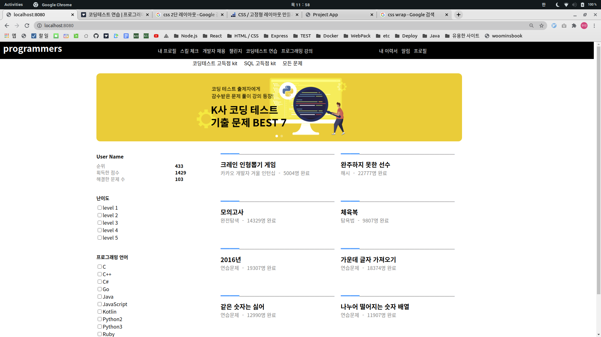

## Facts

- 오전 3시간 동안 HTML/CSS 연습해보고자 프로그래머스 클론을 해보았습니다. 아직 반응형 웹은 적용하지 않았고 앞으로 적용할 예정입니다.  

- 자료구조 DoublyLinkedList와 Stack, Queue를 구현해보았습니다.
- JavaScript 정규식에 대해 간단히 복습하였습니다.
- IDE를 사용하지 않고 프로그래머스 플랫폼에서 "여행 경로" 문제를 해결하였습니다.

## Feelings

- 오랜만에 웹페이지 만들어보니까 재미있네요.

## Findings

- CSS flex-wrap property는 flex-item 요소들이 강제로 한줄에 배치되게 할 것인지, 또는 가능한 영역 내에서 벗어나지 않고 여러행으로 나누어 표현 할 것인지 결정하는 속성입니다.

## Future Action Plans

## Feedback
