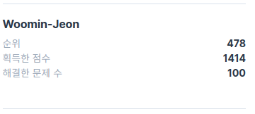

## Facts

- 아침 알고리즘 시간에 드디어 "가장 큰 정사각형 찾기" 문제를 해결하였습니다. 다이나믹 프로그래밍... 너무 어렵네요.
- 문익점 3주차 1단계 과제를 모두 마쳤습니다. Optional에 대해 많이 배운 것 같아요.
- 기봉님과 짝프로그래밍을 통해 "셔틀 버스" 문제를 해결하였습니다.
- 부스트캠프를 위한 이력서 리팩터링을 마치고 제출하였습니다. 좋은 소식이 함께하길...

## Feelings

- 오늘부로 프로그래머스 100문제 해결을 달성하였습니다! 짝짝짝!
  

## Findings

- 숫자는 바로 사용하지 않고 선언해서 변수 이름으로 접근하도록 해야 합니다.

    ```java
    int maxCount = 5;
    if (count < maxCount) { ... }
    ```

- 일급 컬렉션: [jojuldu님의 블로그](https://jojoldu.tistory.com/412?fbclid=IwAR05pjnXlYXy2yUwAayf4N0gVujk-qjsmFcM3jPFCxP--d7-q-g4vHugHzM)
- 객체지향 생활체조 "모든 원시값과 문자열을 포장한다"를 통해 얻을 수 있는 장점으로는 원시값과 문자열을 래핑함으로써 예외처리를 그곳에서 할 수 있다는 것입니다. 예를들어 로또번호는 1 ~ 45까지의 숫자인데 int형만으로는 이 범위를 보장할 수 없습니다. 하지만 이를 객체로 래핑함으로써 1 ~ 45까지의 숫자임을 보장할 수 있습니다.

## Future Action Plans

- [Flux Architecture](https://facebook.github.io/flux) 틈틈히 공부하기로 TIL에 적어놨었는데 까먹었네요. 피드백하다가 발견했습니다. 역시 피드백이 이런점에서 좋네요!
- 객체끼리의 비교를 하고싶을때는 equals를 override하면 된다는 것을 알게되었습니다. hashCode에 대해서도 공부해보라고 하셨었는데 까먹었네요. 이것도 해야합니다. https://minwan1.github.io/2018/07/03/2018-07-03-equals,hashcode/
- 까먹지 말자!

## Feedback
