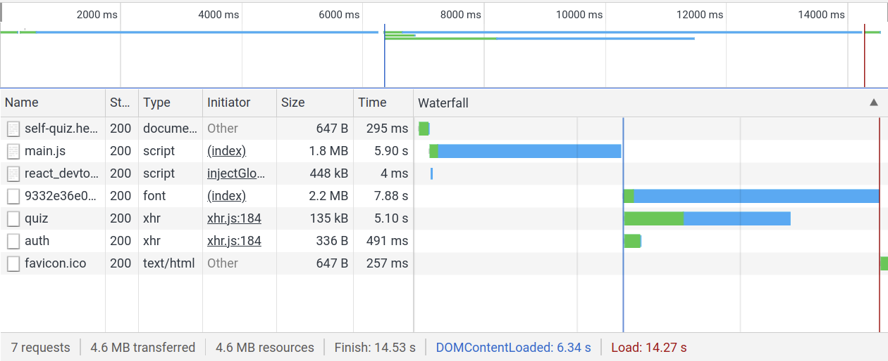
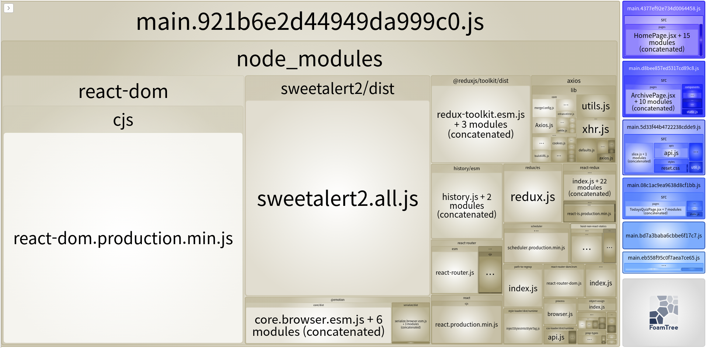
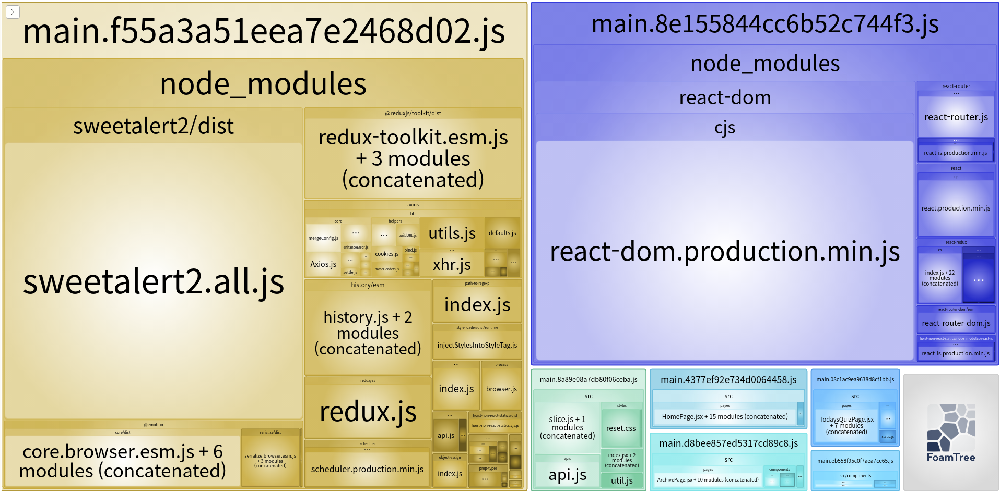
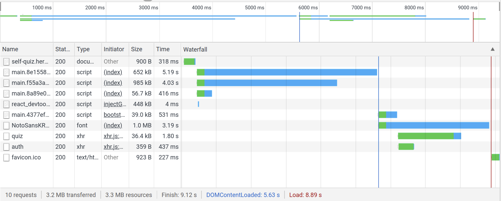

<br><br>

제가 만든 프로젝트 "오늘의 문제"를 직접 사용하다가 종종 첫 페이지 렌더링 속도가 너무 느려서 답답함을 느끼곤 했습니다. 그래서 이러한 문제를 해결하기 위해 제가 했던 과정들을 소개합니다.

<br>

## 문제의 파악

먼저 네트워크 탭을 열어서 무엇때문에 최초 렌더링 속도가 느린지 파악해보았습니다.



<br>

그 결과 다음과 같은 문제점들을 찾을 수 있었습니다.

**1. 빌드 결과물인 main.js 파일을 다운로드하는데 너무 오랜 시간이 걸린다.**  
**2. font를 다운로드하는데 너무 오랜 시간이 걸린다.**  
**3. quiz 데이터를 불러오는데도 시간이 좀 걸린다.**  

<br>

## 해결 1. main.js의 크기 줄이기

저는 먼저 main.js에서 첫 페이지 외에 다른 페이지들은 나중에 불려올 수 있도록 하여 main.js 파일의 크기를 줄여보고자 했습니다.  

### React.lazy 사용하기

`React.lazy`는 다이나믹 import를 사용해서 컴포넌트를 렌더링할 수 있게 하는 함수입니다.  
이는 리액트 라우터에 걸어서 쉽게 사용해볼 수 있었습니다.

  ```js
  const HomePage = lazy(() => import('./pages/HomePage'));
  const QuizPage = lazy(() => import('./pages/QuizPage'));
  const ArchivePage = lazy(() => import('./pages/ArchivePage'));
  const Overlay = lazy(() => import('./pages/Overlay'));

  export default function App() {
    return (
      <>
        <Suspense fallback={<div>로딩중</div>}>
          {modalShowing.overlay && <Overlay />}
          <Router>
            <Switch>
              <Route exact path="/">
                <HomePage />
              </Route>
              <Route path="/page/todaysquiz">
                <QuizPage />
              </Route>
              <Route path="/page/archive">
                <ArchivePage />
              </Route>
            </Switch>
          </Router>
        </Suspense>
      </>
    );
  }
  ```

  하지만 제 프로젝트에서 각 페이지들은 그렇게 무거운 기능을 담고 있지도 않았고, 페이지의 개수 자체도 많지 않았습니다. 따라서 결과물을 살펴본 결과, main.js에서 각 페이지별 컴포넌트들이 차지하는 크기는 50KB 안팎으로, 최초 렌더링 속도에 유의미한 변화를 줄 순 없었던 것 같습니다.

### 코드 스플리팅 사용하기

다음으로 제가 떠올린 방법은 main.js를 쪼개서 다운로드하는 방법이었습니다. main.js를 쪼개기에 앞서 main.js에서 어떤 코드가 비중이 큰지를 확인해볼 필요가 있었고, 이를 위해서 `webpack-bundle-analyzer`라는 플러그인을 사용하였습니다.  

다음은 이 플러그인을 통해 분석된 main.js 파일입니다.



베이지 색 영역이 main.js파일이고, 파란색 영역이 앞서 React.lazy로 분리된 페이지 컴포넌트들입니다.  
베이지 색 영역을 잘 보면, 사실상 **node_modules**가 대부분을 차지하며, 그 중에서도 sweetalert2 모듈 및 리액트 관련 모듈들의 비중이 큰 것을 확인할 수 있었습니다.  

따라서 저는 리액트와 관련된 모듈을 하나의 chunk로 분리하기로 결정하였고, Webpack에서 제공하는(내장되어 있는) `SplitChunksPlugin`을 사용하여 코드를 분할했습니다.

  ```js
  // webpack.config.js

  module.exports = (env, options) => ({
    entry: './src/index.jsx',
    output: {
      path: path.resolve(__dirname, '../server/public/'),
      filename: 'main.[chunkhash].js',
      chunkFilename: 'main.[chunkhash].js',
    },
    optimization: {
      splitChunks: {
        cacheGroups: {
          vendors: {
            test: /[\\/]node_modules[\\/]/,
            chunks: 'all',
            priority: 1,
          },
          reactBundle: {
            test: /[\\/]node_modules[\\/](react|react-dom)/,
            chunks: 'all',
            priority: 2,
          },
        },
      },
    },
    ...
  }
  ```

  이로써 **node_modules**에서 리액트와 관련된 모듈들은 `reactBundle` chunk로 분리하고, 나머지부분들을 `vendors` chunk로 관리합니다.  

  위 코드에서 각 속성의 간단한 설명은 다음과 같습니다.
  
  **splitChunks**: config에서 optimization의 splitChunks 속성을 이용하므로써 SplitChunksPlugin을 사용합니다.  
  **cacheGroups**: 코드 분할의 그룹을 설정합니다.  
  **chunks**: chunks 속성의 기본 값은 'async'인데, 'async'는 다이나믹 import만 분할하는 속성입니다. 따라서 다이나믹 import가 아니더라도 코드가 분할될 수 있도록 'all'로 설정합니다.  
  **priority**: 우선순위를 지정합니다. 만약 reactBundle에 우선순위를 지정해주지 않으면 vendors로 흡수되어 들어가므로 우선순위를 높여줌으로써 따로 분리될 수 있도록 합니다.  

  <br>

  이렇게 분리한 결과를 다시 `webpack-bundle-analyzer`로 살펴보면 다음과 같습니다.



파란색 영역이 **node_modules**에서의 리액트 모듈 부분이고, 노란색 부분이 나머지 부분입니다. 잘 분할된 것을 확인할 수 있습니다.

이렇게 코드 스플리팅을 활용하므로써 main.js 파일을 여러덩이로 쪼개서 동시에 로드할 수 있었습니다.

<br>

## 해결 2. 폰트 파일의 크기 줄이기

기존에 사용하고 있던 폰트는 **NotoSansKR.ttf**였습니다. 하지만 **ttf** 형식의 폰트는 2.2MB로 용량이 컸고, 압축 폰트 형식인 **woff**나 **woff2**를 사용하면 용량을 줄일 수 있다는 것을 알게되었습니다.  
따라서 woff2 형식의 폰트를 사용하므로써 폰트 파일의 크기를 줄였습니다.  

이후에는 `preload`에 대해서 공부하고 이를 적용하여 폰트 파일을 미리 불러옴으로써 주요 렌더링 경로를 줄여볼 생각입니다.

<br>

## 해결 3. quiz 데이터의 크기 줄이기

quiz 데이터의 크기를 줄이기 위해서 `Gzip`을 사용했습니다.  

`Gzip`은 서버에서 리소스를 내려줄 때 파일을 압축해서 전송함으로써 클라이언트가 리소스를 받는 시간을 줄여줍니다. 대부분의 브라우저는 Gzip을 지원하고 있기 때문에 HTTP 헤더에 gzip에 대한 내용을 넣어주기만 하면 사용할 수 있었으며, 제가 서버로 사용하고 있던 Express에서는 Gzip을 사용하는 미들웨어로 `compression`이라는 모듈을 권장하고 있었기에 해당 모듈을 미들웨어로 걸어줌으로써 파일을 압축할 수 있었습니다.  
데이터의 크기를 약 80% 정도 줄일 수 있었던 것 같습니다.

<br>

## 결과

결과적으로 `코드 스플리팅과 lazy loading`을 활용하여 main.js 파일의 크기를 줄일(분할할) 수 있었고, `woff2 형식의 폰트`로 변경함으로써 폰트 파일의 크기도 줄일 수 있었으며, `Gzip`을 사용하여 response 데이터의 용량을 줄일 수 있었습니다.  

이후 네트워크 탭을 열어본 결과
- main.js파일이 기존에 1.8MB에서 985KB, 652KB, 39KB, ... 등등 여러 chunk로 나뉘어져서 동시에 로드되는 것을 확인할 수 있었고,
- 폰트의 크기가 2.2MB에서 1.0MB로 작아진 것을 확인할 수 있었으며,
- quiz 데이터가 135KB에서 36.4KB로 줄어든 것을 확인할 수 있었습니다.



<br><br><br>

## 참고

[React 공식문서 - 코드 스플리팅](https://ko.reactjs.org/docs/code-splitting.html)  
[휴먼 스케이프 기술블로그 - React에서 해보는 코드 스플리팅](https://medium.com/humanscape-tech/react%EC%97%90%EC%84%9C-%ED%95%B4%EB%B3%B4%EB%8A%94-%EC%BD%94%EB%93%9C-%EC%8A%A4%ED%94%8C%EB%A6%AC%ED%8C%85-code-splitting-56c9c7a1baa4)  
[NAVER D2 Hello world - 웹 폰트 사용과 최적화의 최근 동향](https://d2.naver.com/helloworld/4969726)  
[Express 공식문서 - 프로덕션 우수 사례](https://expressjs.com/ko/advanced/best-practice-performance.html#use-gzip-compression)  
[실전 리액트 프로그래밍](http://www.kyobobook.co.kr/product/detailViewKor.laf?ejkGb=KOR&mallGb=KOR&barcode=9788966262670&orderClick=LAV&Kc=)
