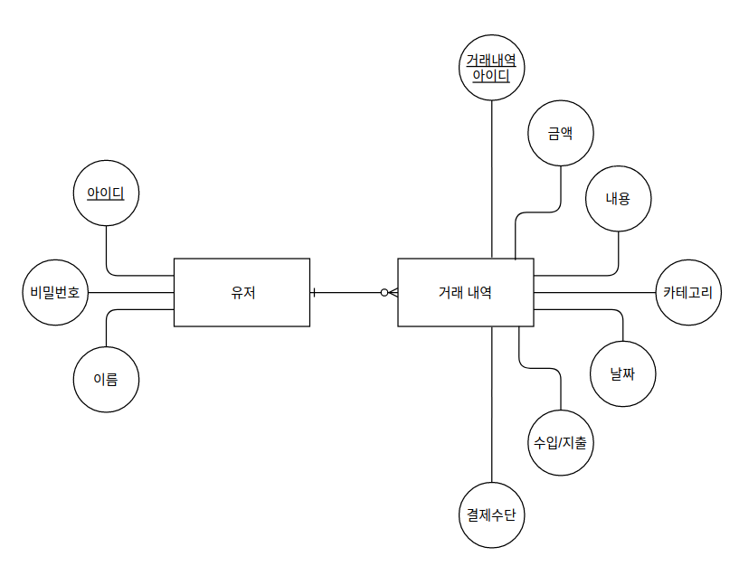

## Facts

- passport와 jwt를 활용한 인증을 TDD로 구현해보고 리팩터링을 마쳤습니다. 최대한 재사용 할 수 있게 만들어 놔서 나중에 프로젝트에서 쓸 때 그냥 붙여 넣으면 될 것 같아요.
- 프로그래머스에서 MySQL 문제를 풀어보았습니다. 기존에는 CRUD 쿼리문만 알고 있었는데 SUM, MAX, MIN, GROUP BY, HAVING, ORDER BY와 같은 유틸 쿼리문도 학습하였습니다.
- 관계형 데이터베이스와 ERD에 대해 공부해보았습니다.
- ERD를 그려보았습니다.
- TIL에 썼지만 한 번 복습하고 넘어가기엔 아쉬운 것들을 모아둔 포스트를 하나 만들었습니다.

## Feelings

- 지금까지 공부해야했지만 미뤄두었던 관계형 데이터베이스의 기초적인 지식들을 오늘에서야 습득할 수 있었는데, 일단은 알게되어 후련한 점이 있고, 미리 알지 못해서 저번 프로젝트에 접목시켜보지 못한 아쉬움도 있습니다.

## Findings

- **ERD**  
  - Entity, Attribute, Relationship으로 구성되는데 Entity를 나누는 기준은 계층 관계로 나타나는 시점입니다. 예를들어, "글"이라는 Entity를 설정하고 그 안에 Attribute로 "제목, 내용, 글쓴이, 댓글"을 설정합니다. 그런데 생각해보니 댓글이라는 Attribute는 댓글을 작성한 사람과 날짜 등의 정보가 또 들어가야 합니다. 이때 관계형 데이터베이스에서는 "글"이라는 Entity의 Attribute를 "제목, 내용, 글쓴이, 댓글(내용, 작성자, 날짜)"로 설정하는 것이 아니라, "댓글"이라는 Entity를 새로 만들어주고 이를 "글"과 연결(relationship) 해주는 것입니다.
  - Key  
    Attribute 중 식별자가 될 수 있는 키의 후보들을 `후보키(Candidate Key)`라고 하며, 이메일, 주민등록번호, 고유 아이디 등등이 가능합니다.  
    그리고 이 후보키들 중 우리가 정한 식별자를 `기본키(Primary Key)`라고 합니다.  
    또한, 이 후보키들 중 기본키가 되지 못한 나머지 키들을 `대체키(Alternate Key)`라고 합니다.  
    외래키는 외래에 있는 테이블과 연결할 수 있는 열쇠로, "A" Entity(Table)에서 "B" Entity(Table)의 기본키(Primary Key)를 가지고 있다면 "A" Entity에 있는 "B"의 Primary Key를 `외래키(Foreign Key)`라고 합니다. 즉 관계형 데이터베이스에서의 relationship은 외래키와 기본키가 연결됨으로써 완성됩니다.  
    참고 사항으로 고유하지 않은 Attribute 여러개를 합쳐서 고유한 키를 만들 수 있다면(예, Email + 전화번호) 이 키들을 `중복키(Composite Key)`라고 합니다.
  - 간단하게 만들어본 ERD입니다. 그런데 결제수단 부분을 어떻게 구현해야할지 감이 잘 안잡히네요 ㅜㅜ
    

## Future Action Plans

- 하기싫어도 제대로 공부해서 실제로 적용해볼 기회를 놓치지 않도록 하겠습니다.
- webpack 공부를 김정환 실습 코드로 따라가보겠습니다.
- 제대로 모르는 것이 있으면, 이건 뭐 이렇게하면 되는거겠지 뭐 ~ 하지 말고 제대로 꼼꼼히 공부하는 습관을 들이도록 하겠습니다. 저번에 써놓았던 Future Action Plan이었는데 못지키고 있네요. 어제 passport에 관해 학습할 때 잘 지키지 못한 것 같습니다.
- 1일 1 Should Read 지키도록 하겠습니다.
- em과 rem에 대한 학습을 하고, 이번 프로젝트에는 적용하도록 하겠습니다.

## Feedback

- 처음 접하는 것에 대해 공부한 뒤 적용해보는 연습을 이번에는 충분히 해봤던 것 같아 뿌듯하다.
- 아직 웹팩 공부는 안했다. 일단 노션 Todo에 올려놓는다.
- 1일 1 Should Read는 잘 못하고 있다 생각보다 스터디가 빡세다.
- rem에 대해 학습하고 프로젝트에 적용했다. 굳
