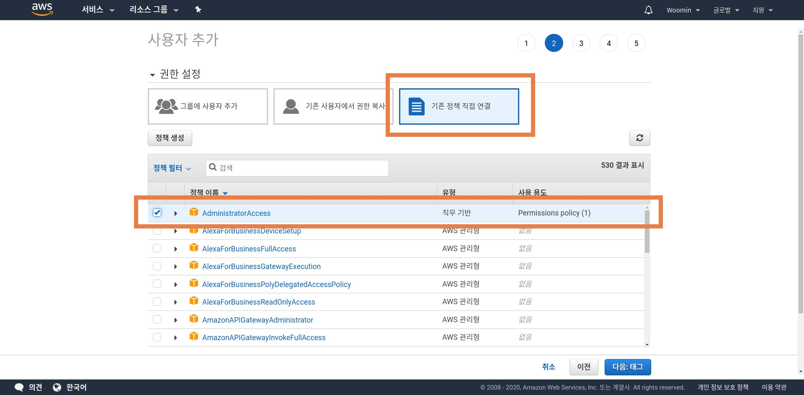

`참고` [jojoldu님의 블로그 게시글](https://jojoldu.tistory.com/281)을 참고했습니다. 와중에 시간이 흘러 조금 바뀐 부분이나 제가 애먹었던 부분에 대해 추가하여 포스팅합니다.  
`참고` AWS EC2 instance가 running 상태임을 전제로 합니다.  
`참고` AWS EC2 instance OS로 Ubuntu를 사용하였습니다.  
`참고` AWS 홈페이지 언어는 "한국어"로 설정한 상태입니다.  

<br />

## AWS IAM 설정하기

<br />

  1. AWS IAM으로 이동하여 사용자를 추가합니다.
    - "사용자" 탭에서 "사용자 추가"를 클릭합니다.
    
    - "사용자 이름"을 자유롭게 설정합니다. (이번 포스팅에서 저는 "admin"으로 하겠습니다)
    - "AWS 엑세스 유형"으로는 "프로그래밍 방식 엑세스"를 체크합니다. (다음)
    
    - "권한 설정"에서 "기존 정책 직접 연결"을 선택합니다.
    - "AdministratorAccess" 하나만을 체크합니다. (다음)
    
    - "태그 추가"는 넘어갑니다. (다음)
    - 최종사항을 검토하고 "사용자 만들기"를 클릭합니다.
    - "엑세스 키 ID(AWS-ACCESS-KEY-ID)"와 "비밀 엑세스 키(AWS-SECRET-ACCESS-KEY"는 반드시 적어놓고 잊어버리지 않도록 해야합니다.
    - 이상으로 사용자 추가를 완료하였습니다.

<br />

  2. AWS IAM으로 이동해서 새로운 그룹을 하나 생성합니다.
    - "그룹" 탭에서 "새로운 그룹 생성"을 클릭합니다.
    
    - "그룹 이름"은 자유롭게 설정합니다. (이번 포스팅에서 저는 "CodeDeploy-group"으로 하겠습니다)
    - 정책 설정은 넘어갑니다. 이후에 직접 스크립트를 넣을겁니다. (다음)
    - 검토를 마치고 "그룹 생성"을 클릭하여 그룹 생성을 마칩니다.
    - 이제 생성한 그룹의 "권한" 탭으로 이동해서 "인라인 정책"을 펼친 후 "여기"를 클릭합니다.
    
    - "사용자 지정 정책"을 선택한 뒤 자유롭게 "정책 이름"을 작성합니다. (이번 포스팅에서 저는 "Custom-policy"로 하겠습니다)
    - 다음 코드를 "정책 문서"에 붙여넣습니다.
    

      ```javascript
      {
          "Version": "2012-10-17",
          "Statement": [
              {
                  "Effect": "Allow",
                  "Action": [
                      "autoscaling:*",
                      "codedeploy:*",
                      "ec2:*",
                      "lambda:*",
                      "elasticloadbalancing:*",
                      "s3:*",
                      "cloudwatch:*",
                      "logs:*",
                      "sns:*"
                  ],
                  "Resource": "*"
              }
          ]
      }
      ```
    - 이제 생성된 그룹의 "사용자" 탭에서 "그룹의 사용자 추가"로 아까 생성하였던 사용자(admin)을 등록합니다.
    

<br />

## EC2에 CodeDeploy-Agent 설치하기

<br />

  1. EC2 instance에 접속해서 aws-cli를 설치하고, 기본 설정을 합니다.
    ```bash
    $ apt-get update
    ```
    ```bash
    $ apt-get install awscli
    ```
    ```bash
    $ aws configure
    -----------------------
    AWS_ACCESS_KEY:  # 아까 적어놓았던 "AWS_ACCESS_KEY"를 여기 적습니다.
    AWS_SECRET_ACCESS_KEY:  # 아까 적어놓았던 "AWS_SECRET_ACCESS_KEY"를 여기 적습니다.
    Default region name:  # ap-northeast-2
    Defalut output format:  # json
    ```

<br />

  2. 설정이 완료되었다면 이제 CodeDeploy Agent를 설치합니다.

      ```bash
      # CodeDeploy Agent 설치
      $ wget https://aws-codedeploy-ap-northeast-2.s3.ap-northeast-2.amazonaws.com/latest/install
      ```

      ```bash
      # 실행 권한 부여
      $ chmod +x ./install
      ```

      ```bash
      # ruby 설치
      $ apt-get install ruby
      ```

      ```bash
      # CodeDeploy Agent 설치 파일 실행
      $ ./install auto
      ```

      ```bash
      # CodeDeploy Agent 실행
      $ service codedeploy-agent start
      ```

      ```bash
      $ service codedeploy-agent status
      -------------------------------------------------
      # Active : active (exited)라고 떠야 재대로 실행중인 것입니다.
      ```

<br />

## 프로젝트에 CodeDeploy 설정 파일 생성하기

<br />

  1. 배포할 프로젝트의 루트에 appspec.yml이라는 파일을 추가합니다.  
     (CodeDeploy Agent는 파일을 받아온 뒤, appspec.yml 파일의 내용을 수행합니다)

      ```yml
      # 참고: appspec.yml 파일은 민감(?)하기 때문에 공백까지 정확하게 기입해주셔야 합니다.

      version: 0.0
      os: linux
      files:
        - source:  /
          destination: /home/ubuntu/build/
      # source는 로컬의 어떤 파일들을 EC2로 옮길지에 대한 것입니다. 현재는 모든 파일("/")을 선택하고 있습니다.
      # destination은 로컬로부터 받아온 파일들을 EC2 instance 어디에 저장할 지에 대한 것입니다.
      # 현재는 /home/ubuntu/build/ 라는 경로를 지정하고 있습니다.
      # 아직 우리는 build라는 디렉토리를 EC2 instance 안에 생성하지 않았기 때문에, 이후에 생성할 것입니다.

      hooks:
        BeforeInstall:
            - location: scripts/beforeInstall.bash
              runas: root
        AfterInstall:
            - location: scripts/afterInstall.bash
              runas: root
      # 로컬의 파일을 받아오기 전에(BeforeInstall) 실행할 스크립트를 지정합니다.
      # 로컬의 파일을 받아온 다음에(AfterInstall) 실행할 스크립트를 지정합니다.
      ```

<br />

  2. appspec.yml 파일 hooks에 설정한대로 bash파일을 생성합니다.  
     프로젝트 루트 디렉토리에 scripts라는 디렉토리를 만들고, 그 안에 beforeInstall.bash 파일과 afterInstall.bash 파일을 생성합니다.  
  
      [beforeInstall.bash]

      ```bash
      if [ -d /home/ubuntu/build ]; then
          rm -rf /home/ubuntu/build
      fi
      # 만약 /home/ubuntu/build 디렉토리가 존재하면 지운다는 의미입니다.

      mkdir -vp /home/ubuntu/build
      # 다시 새로운 /home/ubuntu/build 디렉토리를 생성합니다.

      docker stop [Your Docker Container Name]
      docker rm [Your Docker Container Name]
      # 저는 Docker를 이용할 것이기 때문에, 돌가가고 있는 Docker Container를 중지시키고, 제거합니다.
      # 이후 afterinstall.bash 파일에서 새롭게 받아온 파일을 사용하여 다시 Docker Container를 띄울 예정입니다.
      # [Your Docker Container Name] 예시) woomin-facebook-codedeploy

      if [[ "$(docker images -q [Your DockerHub ID]/[Your Repository Name]:[Your version] 2> /dev/null)" != "" ]]; then
      docker rmi -f $(docker images --format '{{.Repository}}:{{.Tag}}' --filter=reference='[Your DockerHub ID]/[Your Repository Name]:[Your version]')
      fi
      # 해당 Docker Image가 존재하면 image를 제거한다는 뜻입니다.
      # 이후 afterinstall.bash 파일에서 갱신된 이미지를 불러올 것입니다.
      # [Your DockerHub ID]/[Your Repository Name]:[Your version] 예시) dal96k/woomin-facebook:latest
      ```
  
      [afterInstall.bash]
  
      ```bash
      docker pull [Your Docker Image]
      docker run --env-file /home/ubuntu/.env --publish [Local Port Number]:[Docker Port Number] -it --detach --name woomin-facebook-codedeploy [Your Docker Image] /bin/bash

      # DockerHub에 있는 Image를 pull하여 EC2 instance로 가져옵니다.
      # 받아온 Image를 Docker Container에 띄워서 가동시킵니다.

      # [Your Docker Image] 예시) dal96k/woomin-facebook:latest
      # [Local Port Number]:[Docker port Number] 예시) 7000:7000
      # [Your new Docker Container Name] 예시) woomin-facebook-codedeploy

      # DockerHub에 있는 Image는 차후 GitHub Action을 사용해서 git push를 할 때마다 새로운 image를 build 하여 갱신시켜줄 것입니다.
      # 환경변수는 .gitignore에 등록하여 GitHub에 업로드 되지 않으므로 Docker Container를 가동시킬 때 따로 주입해줍니다.
      # 환경변수가 담긴 파일은 별도로 EC2 instance 내에 직접 작성해주셔야 합니다.
      ```

<br />

## AWS EC2와 CodeDeploy에 대한 역할 생성하기

<br />

  1. AWS IAM으로 이동해서 CodeDeploy에 대한 역할을 생성합니다.
    - "역할" 탭의 "역할 만들기"를 클릭합니다.
    
    - "AWS 서비스"를 선택하고 서비스와 사용사례로 "CodeDeploy"를 선택합니다. (다음)
    
    - "권한 정책"으로 "AWSCodeDeployRole"를 확인하고 넘어갑니다. (다음)
    - "태그 추가"는 넘어갑니다. (다음)
    - "검토"에서 "역할 이름"을 자유롭게 작성합니다. (이번 포스팅에서 저는 "CodeDeploy-role-example"로 하겠습니다)
    

<br />

  2. AWS IAM으로 이동해서 EC2에 대한 역할을 생성합니다.
    - "역할" 탭의 "역할 만들기"를 클릭합니다.
    
    - "AWS 서비스"를 선택하고 서비스와 사용사례로 "EC2"를 선택합니다. (다음)
    
    - "권한 정책"으로 총 4개의 정책을 선택합니다. (다음)  
      - "AmazonS3FullAccess"  
      - "AWSCodeDeployFullAccess"  
      - "AWSCodeDeployRole"  
      - "CloudWatchLogsFullAccess"
    - "태그 추가"는 넘어갑니다. (다음)
    - "검토"에서 "역할 이름"을 자유롭게 작성합니다. (이번 포스팅에서 저는 "EC2-role-example"로 하겠습니다)
    

<br />

  3. EC2 instance에 앞서 생성한 EC2 역할을 적용합니다.
    - AWS EC2 "인스턴스" 탭으로 이동하여 실행중인 instance에 마우스 우클릭을 합니다.
    - "인스턴스 설정"에서 "IAM 역할 연결/바꾸기"를 클릭합니다.
    
    - 아까 생성한 EC2-role-example로 IAM 역할을 변경합니다.

<br />

## CodeDeploy 시작하기

<br />

  1. AWS CodeDeploy로 이동하여 애플리케이션을 생성합니다.
    - "애플리케이션" 탭에서 "애플리케이션 생성"을 클릭합니다.
    
    - "애플리케이션 이름"을 자유롭게 작성합니다. (이번 포스팅에서 저는 "CodeDeploy-application-example"로 하겠습니다)
    - "컴퓨팅 플랫폼"으로는 "EC2/온프로미스"를 선택합니다.
    
    - 애플리케이션 생성을 마칩니다.

<br />

  2. 방금 생성한 애플리케이션의 배포그룹을 만들어줍니다.
    - "배포 그룹 생성"을 클릭합니다.  
    
    - "배포 그룹 이름"을 입력합니다. (이번 포스팅에서 저는 "CodeDeploy-group-example"로 하겠습니다)
    - "서비스 역할"로 아까 생성했던 CodeDeploy 정책인 "CodeDeploy-role-example"을 선택합니다.
    - "배포 유형"으로 "현재 위치"를 선택합니다.
    - "환경 구성"으로는 "Amazon EC2 인스턴스"를 선택합니다.
      - 태그의 key와 value는 자유롭게 작성하시면 됩니다. 이번 포스팅에서 저는 아래와 같이 하겠습니다.
      - key: Name
      - value: CodeDeploy-tag-example
      - 현재 상태에서는 "0개의 일치하는 고유 인스턴스"라고 뜰 것입니다.
      - AWS EC2 instance로 이동하여 "태그" 탭을 클릭하고, 태그를 아까 적어놓았던 key, value로 설정합니다.
      - 이제 "1개의 일치하는 고유 인스턴스"라고 뜰 것입니다.
    - "배포 구성"은 초기값 그대로 "CodeDeployDefauly.AllAtOnce"로 하면 됩니다.
    - "로드밸런서"는 활성화하지 않습니다.
    - 이제 "배포 그룹 생성" 버튼을 클릭하고 마칩니다.
    

<br />

  3. 이제 배포를 만들어 봅니다.
    - "애플리케이션" 탭에서 아까 만들 애플리케이션으로 들어갑니다.
    - "배포" 탭에서 "배포 만들기"를 선택합니다.
    
    - "배포 그룹"으로는 아까 만들었던 "CodeDeploy-group-example"를 선택합니다.
    - "개정 유형"으로 "애플리케이션을 GitHub에 저장"을 클릭합니다.
    - "GitHub 토큰 이름"은 자유롭게 작성하시고 GitHub와 연결합니다.
    - "레포지토리 이름"에 배포하고자 하는 프로젝트의 레포지토리를 적습니다.
    - "커밋 ID"에는 가장 최근 commit ID를 적습니다.
    - 나머지는 설정하지 않고 "배포 만들기"를 클릭함으로써 마칩니다.
    

<br />

  4. 참고사항 : 배포 문제 발생 시 CodeDeploy Agent 로그를 확인합니다.

      ```bash
      # EC2 인스턴스에 접속한 뒤,
      $ less /var/log/aws/codedeploy-agent/codedeploy-agent.log
      ```

<br />

## 정리

<br />

   이제 배포가 실행될 것입니다. GitHub에서 가장 최근 커밋을 기준으로 CodeDeploy Agent가 그 시점의 파일들을 모두 받아와서 EC2 instance 안에 설치합니다. 아까 우리는 appspec.yml 파일에서 파일 저장 경로(files: destination)을 "/home/ubuntu/build/" 로 설정하였으므로 저 위치에 파일이 설치될 것입니다. 그리고 afterinstall.bash 파일의 script가 자동으로 Docker Hub에서 최신 Image를 불러오고 Container에 그 이미지를 띄워서 가동시킬 것입니다. 하지만 우리는 아직 Docker Hub에 최신 Image를 build 해서 push 한 적이 없습니다. 그렇기 때문에 이제 GitHub Action을 사용하여 git push를 하면 자동으로 Docker Image를 build하고 Hub로 push 하도록 만들어 보겠습니다.

<br />

## GitHub Action 사용하기

<br />

  1. GitHub Action 설정 파일을 생성합니다.
    - 프로젝트 루트에 ".github"라는 디렉토리를 생성합니다.
    - 그리고 ".github/workflows"라는 디렉토리를 생성합니다.
    - 이제 ".github/workflows/githubaction.yml" 파일을 생성합니다.

<br />

  2. githubaction.yml 파일을 작성합니다.

      ```yml
      name: GitHub Action Example
      on:
        push:
          branches:
            - master

      jobs:
        build:
          runs-on: ubuntu-latest
          steps:
            # master branch로 변경합니다.
            - name: Checkout master
              uses: actions/checkout@master

            # node_modules를 매번 설치하면 비효율적이므로 캐시로 저장해둡니다.
            - name: Cache node modules
              uses: actions/cache@v1
              with:
                path: node_modules
                key: ${{ runner.OS }}-build-${{ hashFiles('**/package-lock.json') }}
                restore-keys: |
                  ${{ runner.OS }}-build-
                  ${{ runner.OS }}-

            # npm 패키지들을 설치합니다.
            - name: Install dependencies
              run: npm install

            # Docker Image를 자동으로 build하고 push합니다.
            # Docker Hub ID와 PW는 GitHub settings에 있는 secrets에 저장해둡니다.
            # [Your DockerHub ID]/[Your Repository Name] 예시) dal96k/woomin-facebook
            - name: Docker image build and push
              uses: docker/build-push-action@v1
              with:
                username: ${{ secrets.DOCKER_ID }}
                password: ${{ secrets.DOCKER_PW }}
                repository: [Your DockerHub ID]/[Your Repository Name]
                tags: latest

            # Docker Hub에 새로운 Image가 push 완료되면 CodeDeploy Agent가 동작되도록 합니다.
            # --application-name과 --deployment-group-name은 아까 작성하신 애플리케이션 이름과 그룹 이름으로 대체하시면 됩니다.
            # [Your GitHub Repository] 예시) Woomin-Jeon/facebook-clone-server
            # "commitId=${GITHUB_SHA}" 코드가 자동으로 최신 commit을 불러옵니다.
            # 아까 보관해두었던 AWS_ACCESS_KEY_ID와 AWS_SECRET_ACCESS_KEY는 GitHub secrets에 저장해둡니다.
            - name: Trigger the CodeDeploy in EC2 instance
              run: aws deploy --region ap-northeast-2 create-deployment --application-name CodeDeploy-application-example --deployment-config-name CodeDeployDefault.OneAtATime --deployment-group-name CodeDeploy-group-example --github-location repository=[Your GitHub Repository],commitId=${GITHUB_SHA}
              env:
                AWS_ACCESS_KEY_ID: ${{ secrets.AWS_ACCESS_KEY_ID }}
                AWS_SECRET_ACCESS_KEY: ${{ secrets.AWS_SECRET_ACCESS_KEY }}
                Default_region_name: ap-northeast-2
      ```

<br />

  3. 마지막으로 git push를 한 뒤 GitHub 홈페이지에 있는 "GitHub Action" 탭으로 가서 확인합니다.

<br />

## 최종 배포 흐름

<br />

  1. Local에서 파일을 수정한 뒤 GitHub에 push합니다.
  2. GitHub Action이 작동합니다.
    - Docker Image가 build되고, Docker Hub에 push됩니다.
    - CodeDeploy Agent에 동작 신호를 줍니다.
  3. CodeDeploy Agent가 동작을 시작합니다.
    - 먼저, 파일의 appspect.yml 파일을 실행합니다.
    - beforeinstall.bash 파일의 script를 실행합니다. 이미 존재하는 이미지를 제거하고, 가동중인 컨테이너를 제거합니다.
    - afterinstall.bash 파일의 script를 실행합니다. 아까 최신화 된 Docker Image를 Hub로부터 받아오고, 컨테이너로 구동시킵니다.
  4. Docker Image 안에 있는 Dockerfile에 "ENTRYPOINT ["npm", "start"]"와 같은 실행 명령어가 존재하면 컨테이너가 구동되면 그 안의 프로젝트를 자동으로 실행합니다.
  5. 배포가 완료되었습니다.


<br />
<br />
<br />